energy
======

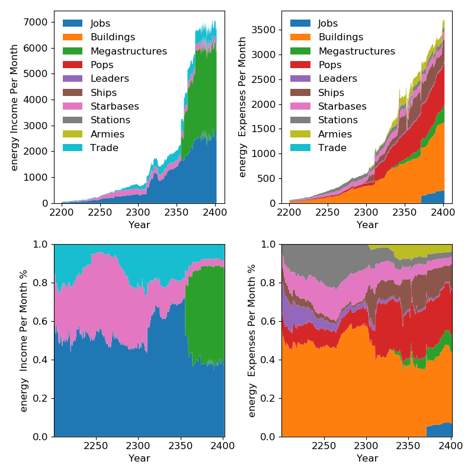

minerals
========

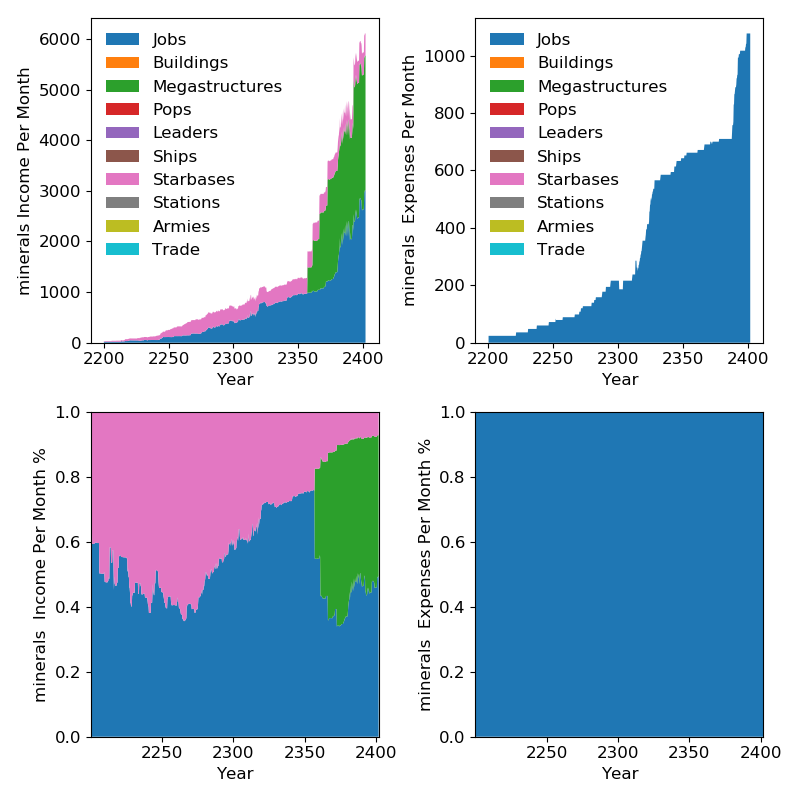

food
====

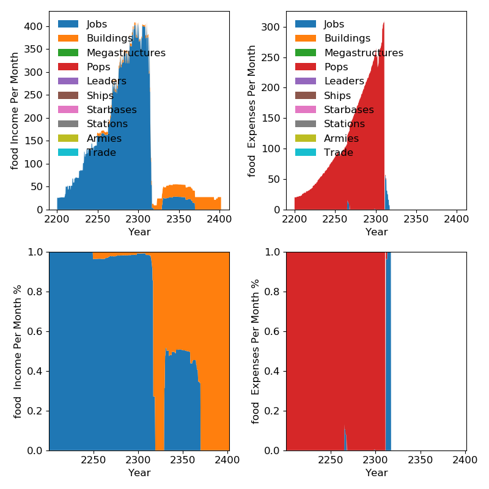

alloys
======

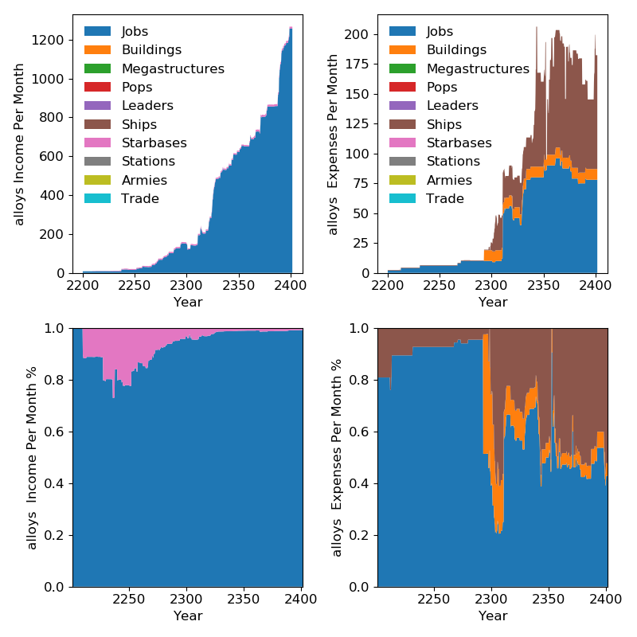

consumer_goods
==============

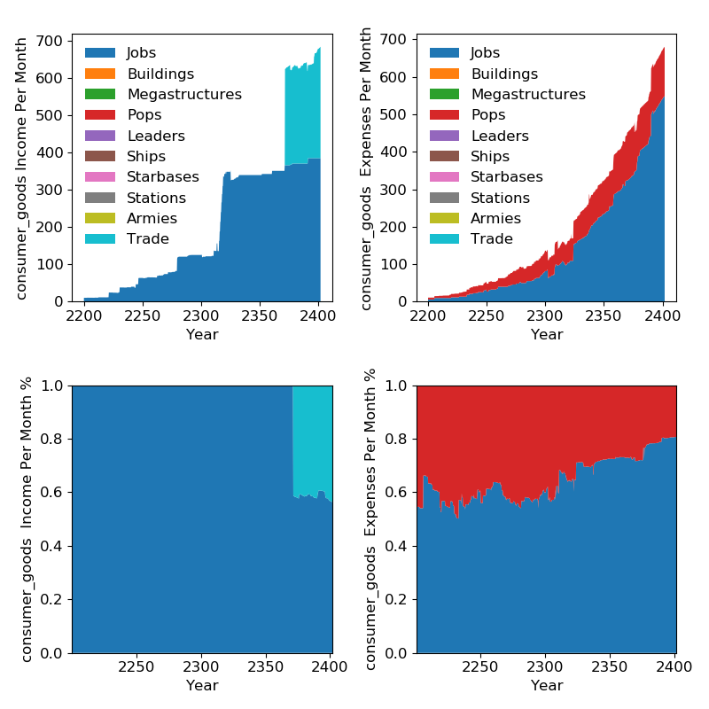

volatile_motes
==============

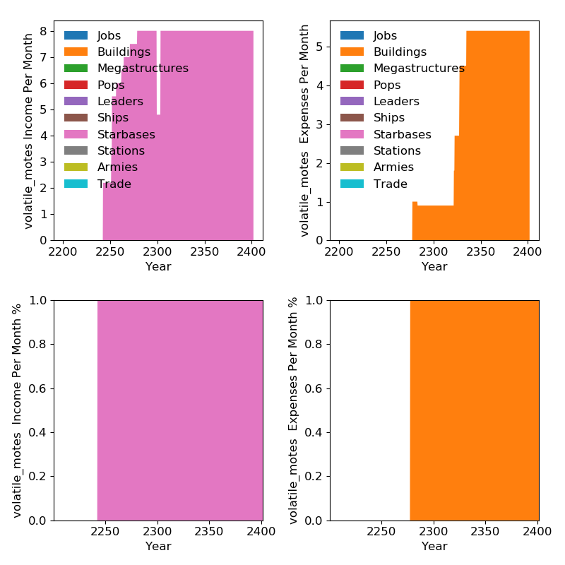

rare_crystals
=============

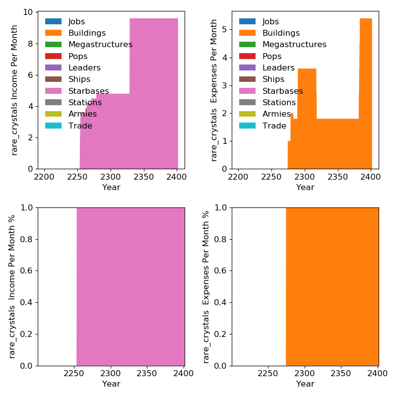

exotic_gases
============

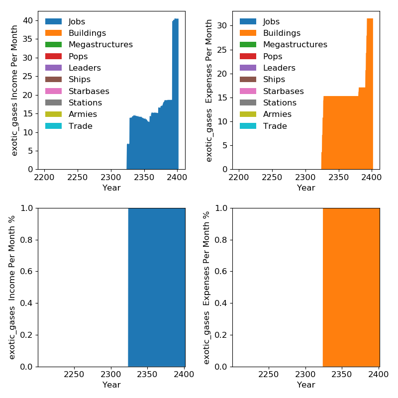

unity
=====

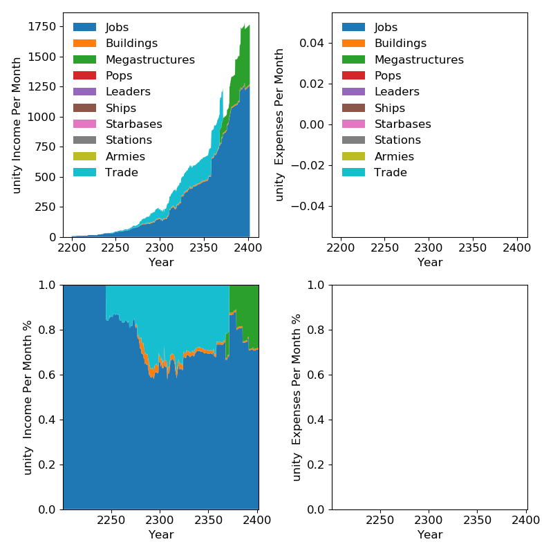

physics_research
================

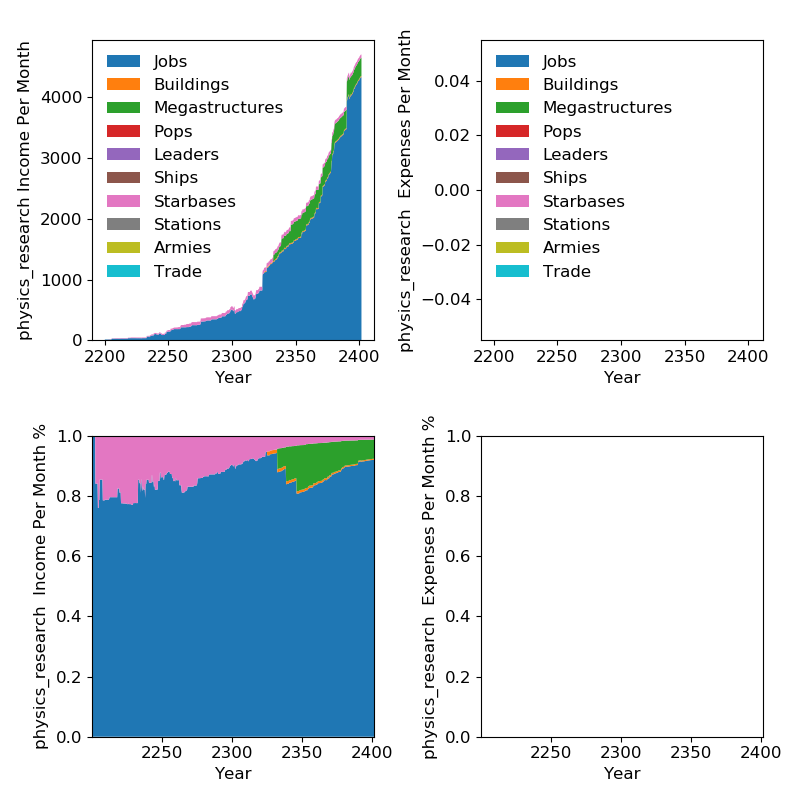

society_research
================

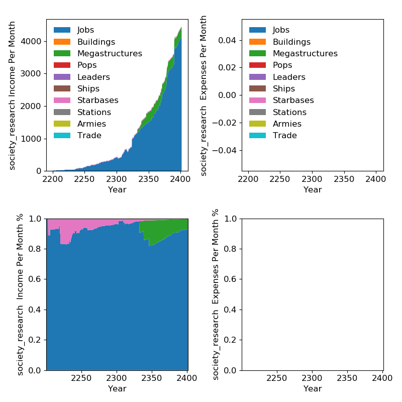

engineering_research
====================

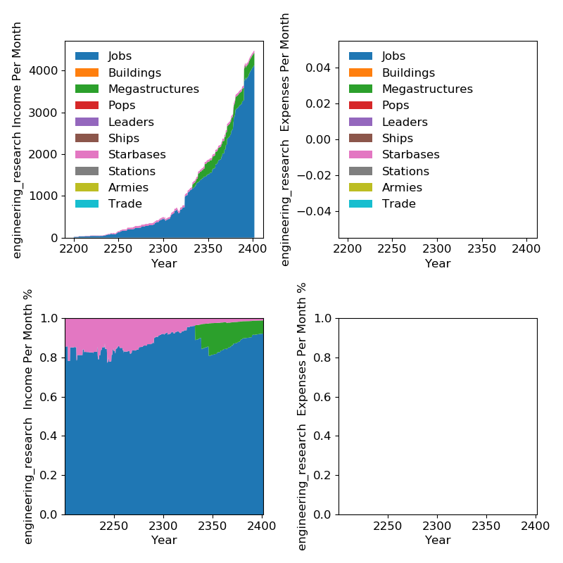

sr_dark_matter
==============

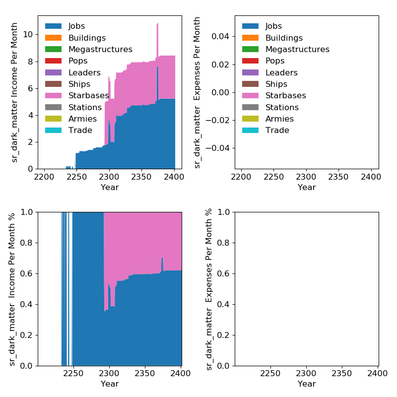

sr_living_metal
===============

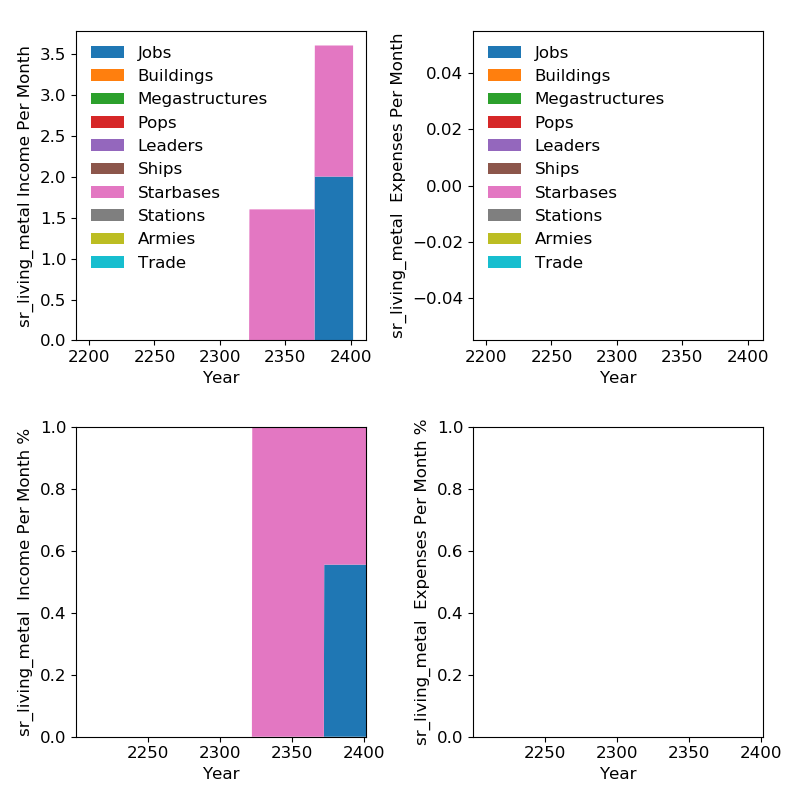

sr_zro
======

.. image:: sr_zro.png
   :width: 960

