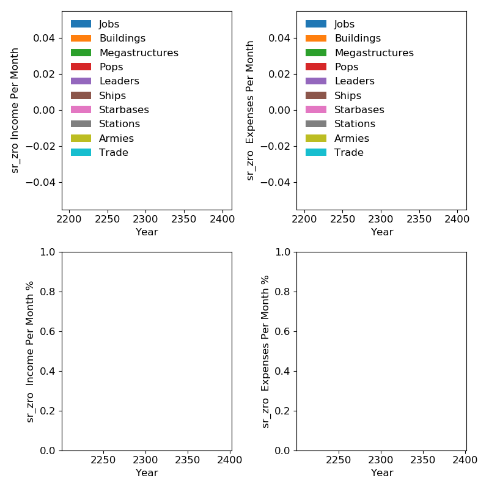

energy
======

minerals
========

.. image:: minerals.png
   :width: 960

food
====

alloys
======

consumer_goods
==============

volatile_motes
==============

rare_crystals
=============

exotic_gases
============

unity
=====

physics_research
================

society_research
================

engineering_research
====================

sr_dark_matter
==============

sr_living_metal
===============

sr_zro
======

