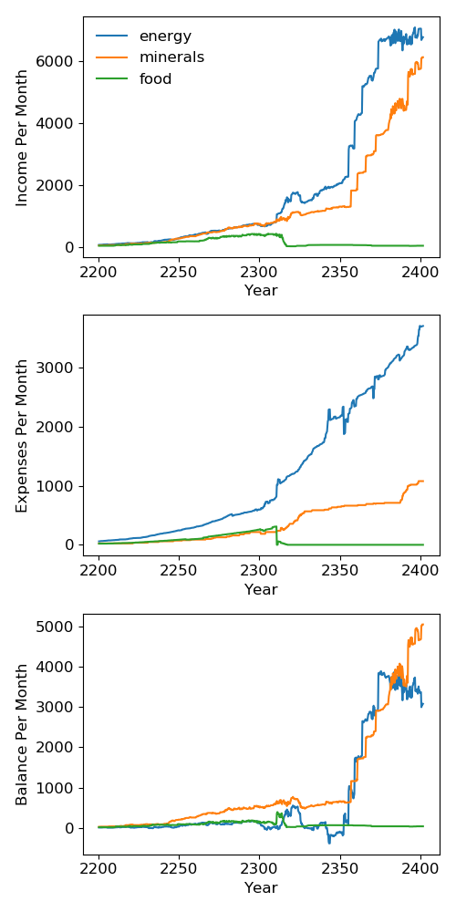
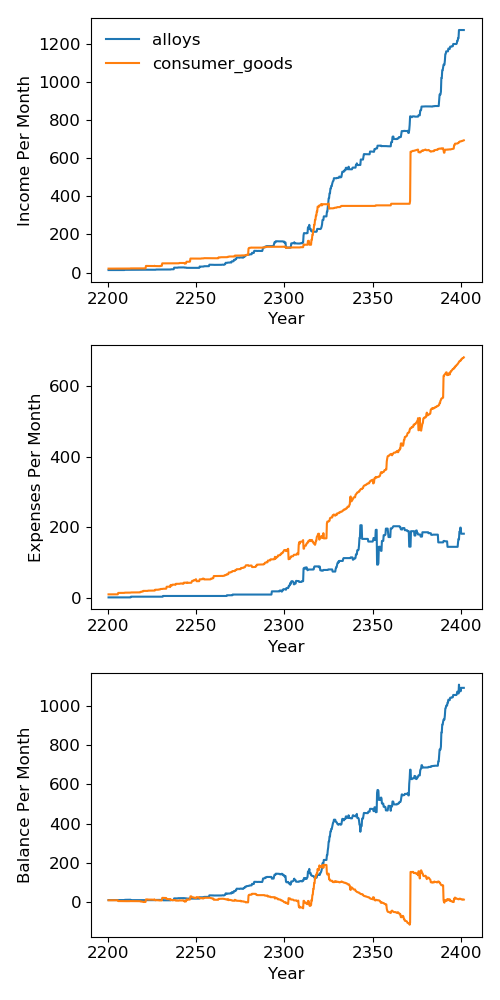
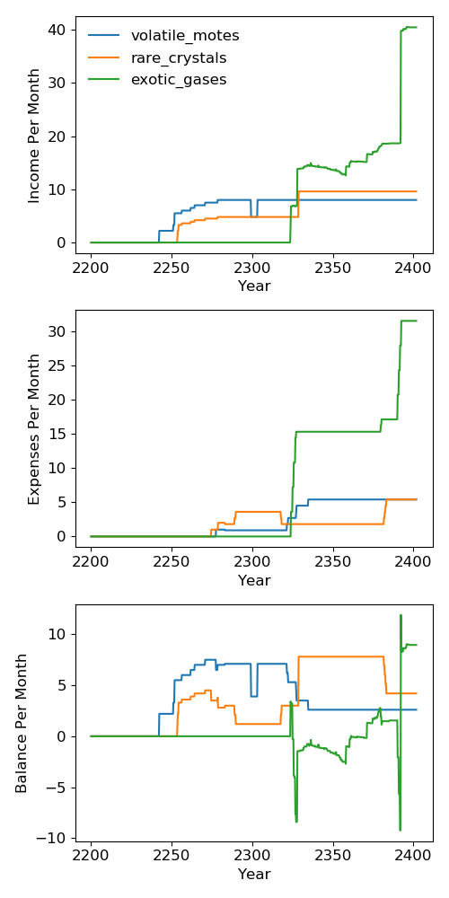
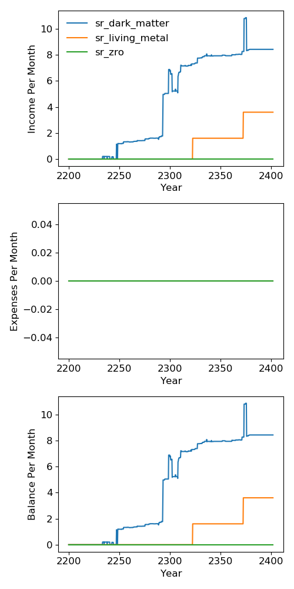
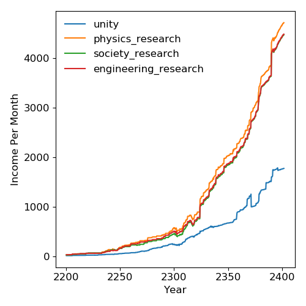
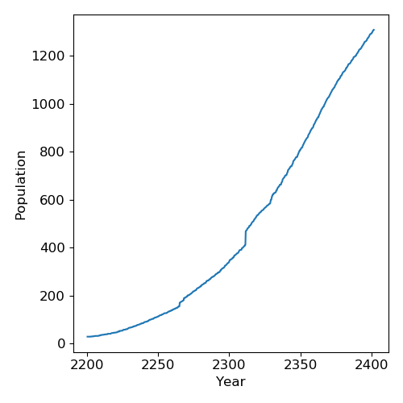
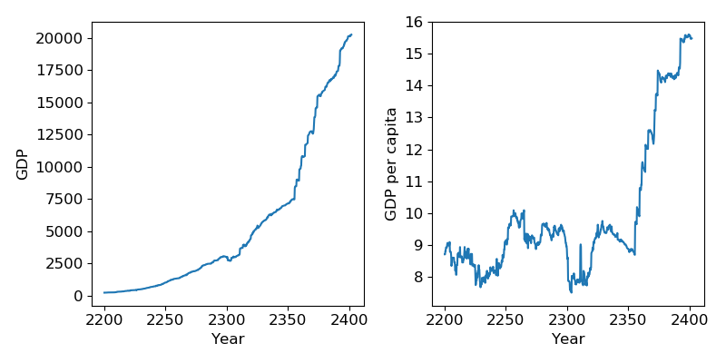

energymineralsfood
==================

alloysconsumer_goods
====================

volatile_motesrare_crystalsexotic_gases
=======================================

sr_dark_mattersr_living_metalsr_zro
===================================

unityphysics_researchsociety_researchengineering_research
=========================================================

Population
==========

Gross Domestic Product
======================

GDP calculated accourding to the standard marked place prices:

.. math::

    \text{GDP} = &\text{Energy} + \text{Minerals} + \text{Food}\\
    &+ 10\left(\text{Volatile Motes} + \text{Rare Crystal} + \text{Exotic Gases}\right)\\
    &+ 20\left(\text{Dark Matter} + \text{Living Metal} + \text{Zro}\right)

